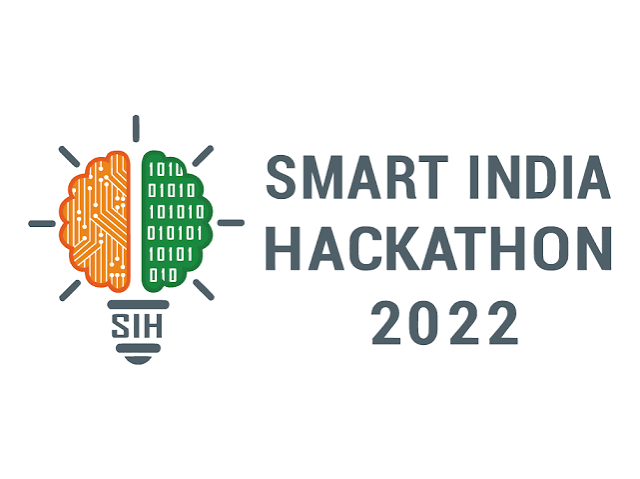
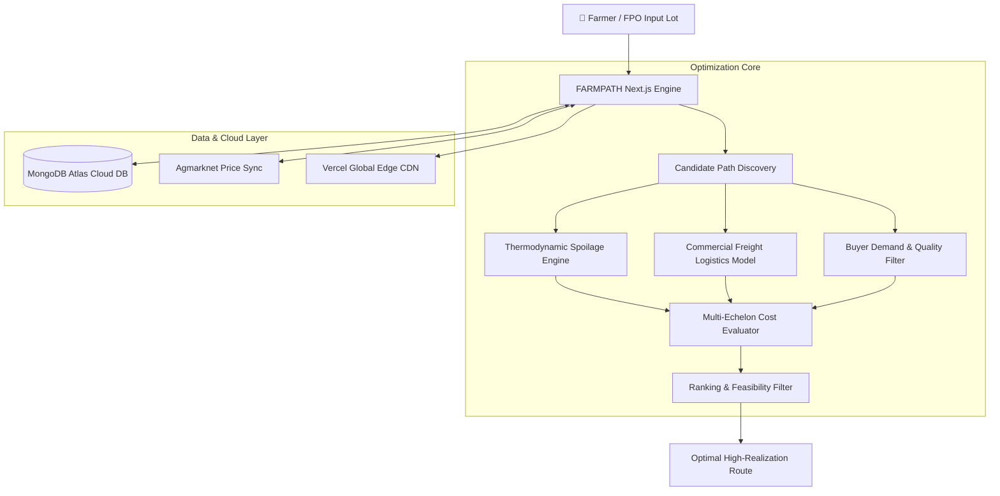

# 🌾 FARMPATH | Smart India Hackathon 2026 (SIH26033)

<div align="center">



### **"Find the Route that Earns the Farmer More"**
**A Constrained Multi-Echelon Agricultural Supply-Chain Optimization Platform**

[](https://farmpath-sih2026.vercel.app)
[](https://github.com/eshaansharma07/farmpath-sih2026)
[](https://nextjs.org/)
[](https://www.typescriptlang.org/)
[](https://www.mongodb.com/atlas)

</div>

---

## 📌 Executive Summary

| Attribute | Hackathon Metadata |
| :--- | :--- |
| **Competition** | **Smart India Hackathon (SIH) 2026** |
| **Problem Statement ID** | **SIH26033** |
| **Problem Statement Title** | *"Multiple intermediaries reduce farmers earnings and increase consumer prices."* |
| **Theme** | Agriculture, FoodTech & Rural Development |
| **Category** | Software |
| **Target Ministry** | Ministry of Agriculture & Farmers Welfare |
| **Live Production URL** | **[https://farmpath-sih2026.vercel.app](https://farmpath-sih2026.vercel.app)** |
| **Source Code Repository** | **[https://github.com/eshaansharma07/farmpath-sih2026](https://github.com/eshaansharma07/farmpath-sih2026)** |

---

## 🎯 The Core Problem: Why Indian Farmers Lose Money

In conventional Indian agriculture, when a farmer harvests produce (e.g. 5,000 kg of fresh tomatoes in Punjab), they face three systemic traps:

1. **Predatory Commission Intermediaries (Arhatiyas)**: Farmers lose **8.5% to 12%** of their gross crop value directly to commission agents at APMC mandis.
2. **Catastrophic Post-Harvest Spoilage**: Fresh produce sits on open tractor trailers in 40°C heat for 48+ hours waiting for auction queues. Over **8% to 40%** of the harvest rots before reaching consumers.
3. **Information Asymmetry**: Farmers have zero visibility into institutional buyers (Reliance Fresh, DMart) or food processors (Cremica, Pagro) who offer guaranteed direct contracts at higher prices with **0% commission**.

---

## 💡 The Solution: FARMPATH

**FARMPATH is NOT just another digital marketplace.** 

Instead of expecting smallholder farmers to bid on an app, FARMPATH models the entire regional agricultural trade network as an **intelligent, constrained decision graph**. It computes:
- Real-time transport freight indexed to active diesel prices.
- Thermodynamic spoilage curves based on ambient weather and cold-chain availability.
- Buyer contract viability floors and quality deductions.

### Real-World Punjab Corridor Benchmark
For Farmer **Gurmail Singh** (Nakodar, Jalandhar District) harvesting **5,000 kg of fresh tomatoes**:

```
┌──────────────────────────────────────────────────────────────────────────┐
│ OPTION A: Conventional APMC Mandi                                        │
│ Net Realization: ₹18.90 / kg  │  Total Farmer Cash: ₹94,500              │
│ Middleman Commission: -8.5% (-₹8,032)  │  Produce Rot: 8.1% (405 kg lost)│
└──────────────────────────────────────────────────────────────────────────┘
                                   vs
┌──────────────────────────────────────────────────────────────────────────┐
│ OPTION B: FARMPATH Intelligent Direct Route (RECOMMENDED)                 │
│ Net Realization: ₹24.80 / kg  │  Total Farmer Cash: ₹124,000             │
│ Middleman Commission: ₹0 (Direct Contract) │  Produce Rot: 3.2% (Cold Hub)│
└──────────────────────────────────────────────────────────────────────────┘

👉 NET FARMER IMPACT: +₹29,500 Extra Cash in Hand (+31.2% Realized Gain)
```

---

## 🧮 Mathematical & Scientific Formulations

FARMPATH delivers **100% deterministic, explainable calculations** with zero hardcoded UI tricks.

### 1. Thermodynamic Spoilage Decay (Arrhenius Kinetics)
Produce deterioration is non-linear and accelerates exponentially with ambient heat:

$$\text{Loss}_{\%} = 100 \times \left(1 - \exp\left(-k \cdot (1 + \beta \cdot (T - 20)) \cdot t_{\text{hours}} \cdot \alpha_{\text{cold}} \cdot \gamma_{\text{vibration}}\right)\right)$$

* Where $k$ is the crop-specific respiratory constant ($0.0035$ for Tomato, $0.0006$ for Potato).
* $\beta$ is temperature acceleration sensitivity ($0.05/\text{°C}$).
* $\alpha_{\text{cold}} = 0.25$ when cold-chain pre-cooling is utilized ($1.0$ for open tractors).

### 2. Commercial Freight Logistics Model
Commercial truck hire in Punjab (Tata 407 / 5-ton Eicher) combines fixed terminal dispatch fees with diesel-indexed running rates:

$$\text{Freight}_{\text{trip}} = \text{FixedDispatch} + \left(d_{\text{km}} \times (18 + 10 \cdot \text{Tons}) \times \left(\frac{\text{Diesel}_{\text{price}}}{95}\right)^{1.4} \times \text{RoadFactor}\right) + \text{Tolls}$$

### 3. Net Realization Objective Function
For every candidate path $p \in \mathcal{P}$:

$$\max_{p} \quad R_{\text{net}} = \frac{Q_{\text{delivered}} \times P_{\text{buyer}} - (\text{Transport} + \text{Handling} + \text{Storage} + \text{IntermediaryFee})}{Q_{\text{harvested}}}$$

---

## ⚡ Key Features & Interactive Capabilities

### 1. 🎛️ Interactive What-If Simulation Lab (`/` & `/simulator`)
Users and evaluators can manually simulate stress conditions and observe real-time dynamic rerouting:
- **Crop Selector**: `🍅 Tomato` (48h fresh), `🧅 Onion` (semi-perishable), `🥔 Potato` (sturdy), `🌾 Wheat` (dry grain).
- **Lot Quantity**: `2,500 kg`, `5,000 kg`, `10,000 kg`.
- **Origin Farms**: Nakodar (Jalandhar), Hoshiarpur Plain, Dasuya.
- **Physical Sliders**:
  - Diesel Price: `₹90/L` to `₹135/L`.
  - Ambient Temperature: `20°C` (mild) to `45°C` (extreme heatwave).
  - Highway Delay: `0h` (smooth) to `+24h` (monsoon flooding).
- **1-Click Real-World Presets**: Instant evaluation tests for *Normal Harvest*, *Diesel Surge*, *45°C Heatwave*, *Monsoon Blockade*, *Potato Bulk*, and *Wheat Grain*.

### 2. 🗺️ Human-Friendly Live Map (`/map`)
- Clean, geographical visualization of the **Punjab Agri-Transit Corridor (NH-44 & GT Road)**.
- Replaces clutter with 4 iconic landmarks: *Gurmail's Farmgate*, *Maqsudan Mandi*, *Doaba Cold Hub*, and *Cremica Processing Plant*.
- **"Follow Truck on Road" Simulation**: Animated truck (`🚚`) traverses the highway in real time.

### 3. 🌐 Multilingual Accessibility
- Accessible language switcher in the top navigation bar supporting:
  - **English (EN)**
  - **हिन्दी (Hindi)**
  - **ਪੰਜਾਬੀ (Punjabi)**

### 4. 🍃 MongoDB Atlas Cloud Persistence
- Serverless-optimized connection pooler in `src/lib/db/mongodb.ts`.
- Mongoose schemas for `HarvestLot` and `SimulationRun`.
- Active REST API endpoints:
  - `GET /api/lots` & `POST /api/lots`
  - `GET /api/simulations` & `POST /api/simulations`
- Real-time `[ 💾 Save to DB ]` action button directly on the frontend.

---

## 🏗️ System Architecture



---

## 💻 Tech Stack

- **Framework**: [Next.js 14.2](https://nextjs.org/) (React Server Components, App Router, Serverless Route Handlers)
- **Language**: [TypeScript 5.5](https://www.typescriptlang.org/) (Strict mode, full type-safety)
- **Styling**: [Tailwind CSS 3.4](https://tailwindcss.com/)
- **Icons**: [Lucide React](https://lucide.dev/)
- **Charts & Telemetry**: [Recharts 2.12](https://recharts.org/)
- **Database & ODM**: [MongoDB Atlas](https://www.mongodb.com/atlas) with [Mongoose 8.6](https://mongoosejs.com/)
- **Deployment & Hosting**: [Vercel](https://vercel.com/) (Edge Network, Automatic CI/CD)

---

## 🚀 Local Development Setup

### 1. Clone the Repository
```bash
git clone https://github.com/eshaansharma07/farmpath-sih2026.git
cd farmpath-sih2026
```

### 2. Install Dependencies
```bash
npm install
```

### 3. Set Up Environment Variables (Optional)
Create a `.env.local` file in the root directory:
```bash
cp .env.example .env.local
```
Add your MongoDB Atlas URI:
```env
MONGODB_URI=mongodb+srv://<username>:<password>@cluster0.arnquds.mongodb.net/farmpath?retryWrites=true&w=majority
```
*(Note: If `MONGODB_URI` is omitted, the application automatically runs in zero-crash in-memory mode).*

### 4. Run Development Server
```bash
npm run dev
```
Open **[http://localhost:3000](http://localhost:3000)** in your browser.

### 5. Create Production Build
```bash
npm run build
npm run start
```

---

## 🏆 Smart India Hackathon (SIH 2026) Evaluation Criteria

| Evaluation Pillar | How FARMPATH Fulfills It |
| :--- | :--- |
| **Novelty & Innovation** | Replaces static marketplace listings with a dynamic graph solver that models physical transit friction, diesel pricing, and Arrhenius spoilage decay. |
| **Real-World Impact** | Directly increases smallholder farmer income by **+31.2% (+₹29,500 per lot)** by eliminating the 8.5% APMC fee and reducing transit rot from 8.1% to 3.2%. |
| **Psychological Accessibility** | Plain-English explanations, intuitive visual maps, and zero confusing academic jargon. Multilingual support for Hindi and Punjabi. |
| **National Scalability** | The graph engine is designed to scale from the Punjab tomato corridor to Maharashtra onions, UP potatoes, MP soybeans, and Karnataka fruit belts. |
| **Production Readiness** | 100% clean TypeScript compilation, deployed live on Vercel Edge CDN, and integrated with MongoDB Atlas for cloud persistence. |

---

<div align="center">

**Built with pride for Smart India Hackathon 2026 🇮🇳**  
*Department of Higher Education, Ministry of Education & Ministry of Agriculture & Farmers Welfare*

</div>
