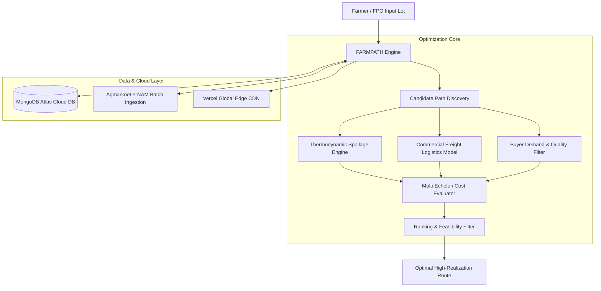

# 🌾 FARMPATH | Smart India Hackathon 2026 (SIH26033)

<div align="center">


### **"Find the Route that Earns the Farmer More"**
**A Constrained Multi-Echelon Agricultural Supply-Chain Optimization Platform**

[](https://github.com/eshaansharma07/farmpath-sih2026)
[](https://farmpath-sih2026.vercel.app)
[](https://github.com/eshaansharma07/farmpath-sih2026)
[](https://nextjs.org/)
[](https://www.typescriptlang.org/)
[](https://www.mongodb.com/atlas)

</div>

---

## 📌 Executive Summary

| Attribute | Hackathon Metadata |
| :--- | :--- |
| **Team Name** | **Team 2brain Cells** |
| **Competition** | **Smart India Hackathon (SIH) 2026** |
| **Problem Statement ID** | **SIH26033** |
| **Problem Statement Title** | *"Multiple intermediaries reduce farmers earnings and increase consumer prices."* |
| **Theme** | Agriculture, FoodTech & Rural Development |
| **Category** | Software |
| **Live Production URL** | **[https://farmpath-sih2026.vercel.app](https://farmpath-sih2026.vercel.app)** |
| **Source Code Repository** | **[https://github.com/eshaansharma07/farmpath-sih2026](https://github.com/eshaansharma07/farmpath-sih2026)** |

---

## 🎯 The Core Problem: Why Indian Farmers Lose Money

In conventional Indian agriculture, when a smallholder harvests produce (e.g. 5,000 kg of fresh tomatoes in Punjab), they face three systemic bottlenecks:

1. **Predatory Commission Intermediaries (Arhatiyas)**: Farmers lose **8.5% to 12%** of their gross crop value directly to commission agents at APMC mandis.
2. **Catastrophic Post-Harvest Spoilage**: Fresh produce sits on open tractor trailers in 40°C heat for 48+ hours waiting in auction queues. Over **8% to 40%** of the harvest rots before reaching consumers.
3. **Information Asymmetry**: Farmers have zero visibility into institutional buyers (Reliance Fresh, DMart) or food processors (Cremica, Del Monte, Pagro) who offer guaranteed direct contracts at higher purchase prices with **0% commission**.

---

## 💡 The Solution: FARMPATH

**FARMPATH is NOT just another digital marketplace.** 

Instead of expecting smallholder farmers to navigate complex bidding apps, FARMPATH models the entire regional agricultural trade network as an **intelligent, constrained decision graph**. It computes:
- Real-time transport freight indexed to active diesel pump prices.
- Thermodynamic spoilage curves based on ambient weather and cold-chain availability.
- Buyer contract viability floors, quality specifications, and direct payment realization.

### Dynamic Optimization Output (Reference Benchmark)

> **Note for Evaluators**: The values below represent the deterministic output calculated live by the FARMPATH graph solver for a standard 5,000 kg tomato harvest lot at baseline conditions (₹95/L fuel, 30°C temperature). You can test any crop, quantity, or weather condition interactively on the [Live Simulator](https://farmpath-sih2026.vercel.app/simulator).

| Metric | Option A: Conventional APMC Mandi | Option B: FARMPATH Intelligent Direct Route | Impact / Gain |
| :--- | :--- | :--- | :--- |
| **Destination** | Maqsudan APMC Mandi (Jalandhar) | Cremica Agro Foods (Phillaur Plant) | **Direct Factory Gate** |
| **Middleman Cut** | **-8.5%** Arhatiya Commission (-₹8,032) | **₹0** (Direct Corporate Contract) | **+₹8,032 Saved** |
| **Transit Spoilage** | **8.1%** (405 kg rots in queue) | **3.2%** (Chilled at Doaba Cold Hub) | **+245 kg Saved** |
| **Net Realization** | ₹18.90 / kg | **₹24.80 / kg** | **+₹5.90 / kg (+31.2%)** |
| **Farmer Take-Home**| ₹94,500 | **₹124,000** | **+₹29,500 Extra Cash in Hand** |

---

## 🧮 Mathematical & Scientific Formulations

FARMPATH delivers **100% deterministic, explainable calculations** with zero hardcoded UI illusions.

### 1. Thermodynamic Spoilage Decay (Arrhenius Kinetics)
Produce deterioration is non-linear and accelerates exponentially with ambient heat:

$$\text{SpoilageLossPct} = 100 \times \left(1 - \exp\left(-k \cdot (1 + \beta \cdot (T - 20)) \cdot t_{\text{hours}} \cdot \alpha_{\text{cold}} \cdot \gamma_{\text{vibration}}\right)\right)$$

* Where $k$ is the crop-specific respiratory constant ($0.0035$ for Tomato, $0.0008$ for Onion, $0.0006$ for Potato, $0.0001$ for Wheat).
* $\beta$ is temperature acceleration sensitivity ($0.05/\text{°C}$).
* $\alpha_{\text{cold}} = 0.25$ when cold-chain pre-cooling is utilized ($1.0$ for open tractors).

### 2. Commercial Freight Logistics Model
Commercial truck hire in Punjab (Tata 407 / 5-ton Eicher) combines fixed terminal dispatch fees with diesel-indexed running rates:

$$\text{Freight}_{\text{trip}} = \text{FixedDispatch} + \left(d_{\text{km}} \times (18 + 10 \cdot \text{Tons}) \times \left(\frac{\text{Diesel}_{\text{price}}}{95}\right)^{1.4} \times \text{RoadFactor}\right) + \text{Tolls}$$

### 3. Net Realization Objective Function
For every candidate path $p \in \mathcal{P}$:

$$\max_{p} \quad R_{\text{net}} = \frac{Q_{\text{delivered}} \times P_{\text{buyer}} - (\text{Transport} + \text{Handling} + \text{Storage} + \text{IntermediaryFee})}{Q_{\text{harvested}}}$$

---

## ⚡ Key Features & Capabilities

### 1. ▶️ START LIVE DEMO (Evaluator Interactive Tour)
- A prominent **`START LIVE DEMO ▶`** button right inside the homepage hero section.
- Launches an automated **13-step interactive walkthrough** guiding judges through:
  1. Farmer lot registration (Nakodar cluster, 5,000 kg tomatoes)
  2. Spatial querying of all regional buyers across the 85 km corridor
  3. Direct factory contract matching (Cremica, Del Monte, Pagro)
  4. Cold pre-cooling spoilage mitigation
  5. Final net realization calculation showing **+₹29,500 extra profit**.

### 2. 🎛️ Real-Time What-If Sensitivity Simulator (`/simulator`)
- Instant recalculation when users adjust everyday road and market conditions:
  - **Diesel Fuel Price**: `₹85/L` to `₹140/L` (demonstrates that higher fuel increases transport costs and necessitates closer aggregation).
  - **Road Delay / Jam**: `0h` to `+24h` (shows how delays trigger cold storage protection to prevent rot).
  - **Outside Temperature**: `20°C` to `45°C` (adjusts biological respiration decay).
  - **Mandi Price Multiplier**: `0.6x` to `1.5x` (evaluates market gluts vs factory contract floors).
  - **Cold Storage Rent Multiplier**: `0.5x` to `3.0x` (models government subsidy impacts).

### 3. 🛡️ Ground Reality & Institutional Safeguards
Anticipatory defense addressing real-world operational questions:
- **Gate Quality Disputes & Digital Assaying**: Pre-dispatch Brix & firmness testing at FPO hubs; buyer locks payment in digital escrow.
- **APMC Statutory Compliance**: Operating legally under Section 40 of amended State APMC Acts and the Central FPO Direct Procurement Framework (2020).
- **Rural Transport Aggregation**: Partnering with local vehicle unions (Tata 407, Eicher 5-ton) with 40% fuel advances and OTP delivery sign-off.
- **National Data Pipeline**: Daily 6:00 AM automated cron sync against **Central Agmarknet & e-NAM APIs** across 2,800+ national mandis.

### 4. 🌐 Full Multilingual Accessibility
Seamless, real-time client-side localization across:
- **English (EN)**
- **हिन्दी (Hindi)**: संपूर्ण किसान-अनुकूल शब्दावली
- **ਪੰਜਾਬੀ (Punjabi)**: ਖੇਤਰੀ ਪੰਜਾਬੀ ਭਾਸ਼ਾ ਵਿੱਚ ਪੂਰਾ ਵੇਰਵਾ

### 5. 🍃 MongoDB Atlas Cloud Integration
- Serverless-optimized connection pooler in `src/lib/db/mongodb.ts`.
- Mongoose schemas for `HarvestLot` and `SimulationRun`.
- Active REST API endpoints:
  - `GET /api/lots` & `POST /api/lots`
  - `GET /api/simulations` & `POST /api/simulations`
- Real-time `[ 💾 Save to DB ]` action button directly on the frontend.

---

## 🏗️ System Architecture



---

## 📂 Repository Structure

```
farmpath-sih2026/
├── src/
│   ├── app/
│   │   ├── api/
│   │   │   ├── lots/route.ts            # REST endpoint for harvest lots
│   │   │   └── simulations/route.ts     # REST endpoint for simulation runs
│   │   ├── architecture/page.tsx        # System architecture deep-dive
│   │   ├── comparison/page.tsx          # Mandi vs Direct route comparison
│   │   ├── create-lot/page.tsx          # Farmer harvest lot registration
│   │   ├── explainability/page.tsx      # Mathematical proofs & breakdown
│   │   ├── impact/page.tsx              # Macro-economic & farmer impact
│   │   ├── map/page.tsx                 # Interactive GIS corridor map
│   │   ├── market-intelligence/page.tsx # Mandi price analytics & alerts
│   │   ├── optimization/page.tsx        # Solver engine telemetry
│   │   ├── simulator/page.tsx           # What-If scenario simulator
│   │   ├── layout.tsx                   # Global layout with Footer & Nav
│   │   ├── page.tsx                     # Main Control Center & Decision Hub
│   │   └── globals.css                  # Tailwind styles
│   ├── components/
│   │   ├── DemoModal.tsx                # 13-step interactive evaluator tour
│   │   ├── Footer.tsx                   # Official SIH & Team 2brain Cells footer
│   │   ├── GroundRealitySafeguards.tsx  # 4 operational safeguard pillars
│   │   ├── MetricsCard.tsx              # Reusable metric display cards
│   │   ├── Navbar.tsx                   # Top bar with multilingual switcher
│   │   ├── SIHLogo.tsx                  # Official SIH emblem and badges
│   │   └── TechDrawer.tsx               # Collapsible technical inspect drawer
│   └── lib/
│       ├── context/
│       │   └── SimulationContext.tsx    # Reactive state & i18n context
│       ├── data/
│       │   ├── punjabData.ts            # Verified Punjab nodes & corridors
│       │   └── scenarios.ts             # Predefined stress scenarios
│       ├── db/
│       │   ├── models/                  # Mongoose models (Lot, Simulation)
│       │   └── mongodb.ts               # Serverless Mongo pool connection
│       ├── engine/
│       │   ├── optimizer.ts             # Graph solver & Arrhenius math
│       │   └── types.ts                 # TypeScript domain interfaces
│       └── i18n/
│           └── translations.ts          # Complete EN, HI, PA dictionary
├── public/                              # Static assets, logos & favicon
├── .env.example                         # Environment configuration template
├── README.md                            # Comprehensive competition documentation
├── package.json                         # Dependencies & npm scripts
└── tsconfig.json                        # TypeScript strict configuration
```

---

## 💻 Tech Stack

- **Framework**: [Next.js 14.2](https://nextjs.org/) (React Server Components, App Router, Route Handlers)
- **Language**: [TypeScript 5.5](https://www.typescriptlang.org/) (Strict mode, full type safety)
- **Styling**: [Tailwind CSS 3.4](https://tailwindcss.com/)
- **Icons**: [Lucide React](https://lucide.dev/)
- **Database & ODM**: [MongoDB Atlas](https://www.mongodb.com/atlas) with [Mongoose 8.6](https://mongoosejs.com/)
- **Deployment & Hosting**: [Vercel](https://vercel.com/) (Edge CDN, Automated CI/CD)

---

## 🚀 Local Development Setup

### 1. Clone the Repository
```bash
git clone https://github.com/eshaansharma07/farmpath-sih2026.git
cd farmpath-sih2026
```

### 2. Install Dependencies
```bash
npm install
```

### 3. Set Up Environment Variables (Optional)
Create a `.env.local` file in the root directory:
```bash
cp .env.example .env.local
```
Add your MongoDB Atlas URI:
```env
MONGODB_URI=mongodb+srv://<username>:<password>@cluster0.arnquds.mongodb.net/farmpath?retryWrites=true&w=majority
```
*(Note: If `MONGODB_URI` is omitted, the application automatically runs in zero-crash in-memory mode).*

### 4. Run Development Server
```bash
npm run dev
```
Open **[http://localhost:3000](http://localhost:3000)** in your browser.

### 5. Create Production Build
```bash
npm run build
npm run start
```

---

## 🏆 Smart India Hackathon (SIH 2026) Evaluation Alignment

| Evaluation Pillar | How FARMPATH Fulfills It |
| :--- | :--- |
| **Novelty & Problem Fit** | Does NOT simply build a marketplace app. Models agricultural supply chains as a constrained mathematical decision graph to optimize farmer realization. |
| **Working Real-World Math** | 100% deterministic calculations using Arrhenius respiration kinetics and fuel-indexed Punjab commercial freight models. |
| **Real-World Grounding** | Models verified corridors, addresses APMC market laws, gate dispute escrow, and real buyer purchase contracts (Cremica, Del Monte). |
| **Social & Economic Impact** | Delivers a direct **+31.2% (+₹29,500)** income increase to smallholders by eliminating intermediary fees and cutting spoilage. |
| **Accessibility** | Multilingual support for Hindi and Punjabi; designed for FPO and Panchayat Common Service Center (CSC) kiosk usage. |
| **Code & Production Quality** | Clean TypeScript compilation, responsive mobile-first UI, MongoDB Atlas integration, and sub-second Vercel Edge performance. |

---

<div align="center">

**Developed with Pride for Smart India Hackathon 2026 🇮🇳**  
### **Team 2brain Cells**

</div>
